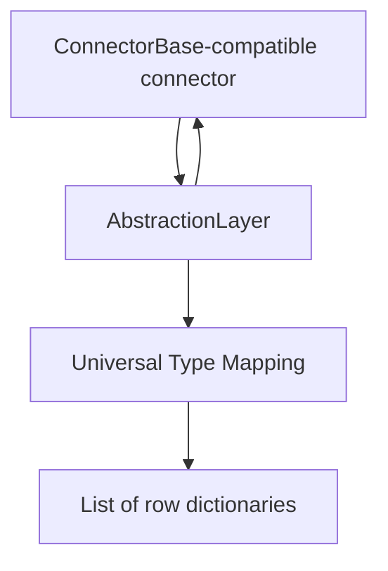

# Unified Abstraction-Layer Interface Sketch v1

## 1. Purpose

This document sketches the unified abstraction-layer interface for the PostgreSQL, MySQL, and Microsoft SQL Server connectors.

The abstraction layer wraps any `ConnectorBase`-conformant connector and applies the Universal Type Mapping module to query results. It must preserve the existing public result format and connector error behavior.

This is a design sketch only. Implementation begins in Week 12.

## 2. Design Goals

The abstraction layer must:

- accept any connector that conforms to the common connector interface;
- delegate connection and database operations to the wrapped connector;
- normalize query results through the Universal Type Mapping module;
- preserve the `List[Dict[str, Any]]` query-result format;
- preserve affected-row counts returned by write operations;
- preserve `ConnectorError` and its `retryable` information;
- allow optional functionality through mixins or independent modules;
- avoid database-specific logic inside the abstraction-layer wrapper.

## 3. Proposed Module Structure

```text
connectors/
├── base.py
├── postgres_connector.py
├── mysql_connector.py
└── mssql_connector.py

abstraction/
├── abstraction_layer.py
├── type_mapping.py
├── metadata.py
├── errors.py
└── mixins/
    ├── retry_mixin.py
    └── logging_mixin.py
```

| Module | Responsibility |
|---|---|
| `base.py` | Defines the common connector contract |
| `abstraction_layer.py` | Wraps a connector and coordinates operations |
| `type_mapping.py` | Resolves canonical types and normalizes values |
| `metadata.py` | Represents native column and type metadata |
| `errors.py` | Provides the shared `ConnectorError` contract |
| `retry_mixin.py` | Adds optional retry behavior |
| `logging_mixin.py` | Adds optional operation logging |

## 4. Component Relationship



The wrapper delegates database operations to the connector and sends returned query values to the type-mapping module before exposing them to the caller.

## 5. Connector Contract

A connector is considered compatible when it provides the following operations:

```python
class ConnectorBase(Protocol):
    def connect(self) -> None: ...
    def disconnect(self) -> None: ...

    def execute_query(
        self, sql: str, params: Any = None
    ) -> List[Dict[str, Any]]: ...

    def execute_write(
        self, sql: str, params: Any = None
    ) -> int: ...

    def health_check(self) -> bool: ...
```

A structural `Protocol` allows the current connectors to conform without requiring immediate inheritance changes.

## 6. Abstraction-Layer Interface

```python
class AbstractionLayer:
    def __init__(
        self,
        connector: ConnectorBase,
        type_mapper: TypeMapper,
    ) -> None:
        self.connector = connector
        self.type_mapper = type_mapper

    def connect(self) -> None:
        self.connector.connect()

    def disconnect(self) -> None:
        self.connector.disconnect()

    def execute_query(
        self, sql: str, params: Any = None
    ) -> List[Dict[str, Any]]:
        rows = self.connector.execute_query(sql, params)
        metadata = self.type_mapper.resolve_metadata(
            self.connector, sql
        )
        return self.type_mapper.normalize_rows(rows, metadata)

    def execute_write(
        self, sql: str, params: Any = None
    ) -> int:
        return self.connector.execute_write(sql, params)

    def health_check(self) -> bool:
        return self.connector.health_check()
```

This pseudocode defines responsibilities and method signatures. It is not the Week 12 implementation.

## 7. Type-Mapping Interface

```python
class TypeMapper(Protocol):
    def resolve_metadata(
        self,
        connector: ConnectorBase,
        sql: str,
    ) -> List[ColumnMetadata]: ...

    def normalize_rows(
        self,
        rows: List[Dict[str, Any]],
        metadata: List[ColumnMetadata],
    ) -> List[Dict[str, Any]]: ...
```

`ColumnMetadata` should contain the column name, native type, canonical type, and relevant precision, scale, length, signedness, or time-zone information.

## 8. Query and Write Behavior

### Query execution

1. The wrapper delegates the SQL statement to the connector.
2. The connector returns `List[Dict[str, Any]]`.
3. Native column metadata is resolved.
4. The type-mapping module normalizes each value.
5. The wrapper returns the same row-and-column structure.

Column names and row order must not change. Mapping metadata must not appear as additional result columns.

### Write execution

`execute_write()` does not require value normalization. The abstraction layer returns the connector’s affected-row count unchanged.

Transaction commit and rollback remain the connector’s responsibility.

## 9. Error and Retry Behavior

The abstraction layer must not replace a connector failure with a generic exception.

```python
class ConnectorError(Exception):
    def __init__(
        self,
        message: str,
        retryable: bool = False,
    ) -> None:
        super().__init__(message)
        self.retryable = retryable
```

When a connector raises `ConnectorError`:

- the wrapper preserves its message and `retryable` value;
- normalization failures are raised as non-retryable connector errors;
- retries occur only when an optional retry policy is enabled and `retryable` is `True`;
- authentication, invalid SQL, and normalization errors are not retried;
- error messages must not expose credentials or sensitive values.

The existing PostgreSQL and MySQL errors currently lack a `retryable` attribute. Until they use the shared error class, the abstraction layer should interpret a missing attribute as `False`.

## 10. Optional Mixins

Optional behavior must remain separate from the core wrapper.

```python
class RetryingAbstractionLayer(
    RetryMixin,
    AbstractionLayer,
):
    pass
```

The core `AbstractionLayer` must work without retry or logging mixins. Mixins may wrap operations but must not change return types or type-mapping rules.

## 11. Compatibility Requirements

The Week 12 implementation must confirm that:

- all three connectors satisfy the connector contract;
- `execute_query()` still returns `List[Dict[str, Any]]`;
- `execute_write()` still returns `int`;
- `health_check()` still returns `bool`;
- SQL `NULL` remains Python `None`;
- `ConnectorError` remains the public error contract;
- type normalization does not change column names or row order;
- connector-specific code remains outside the wrapper;
- existing connector tests continue to pass.